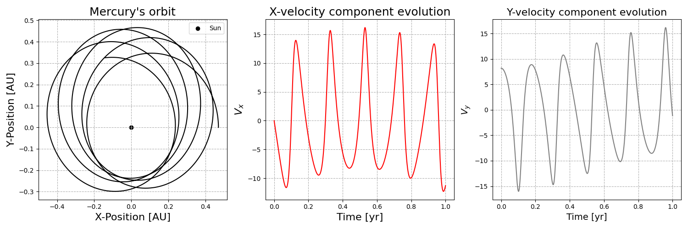
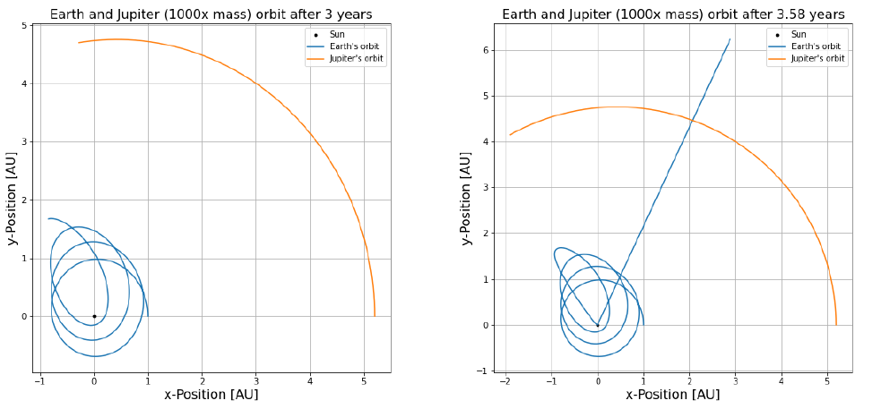
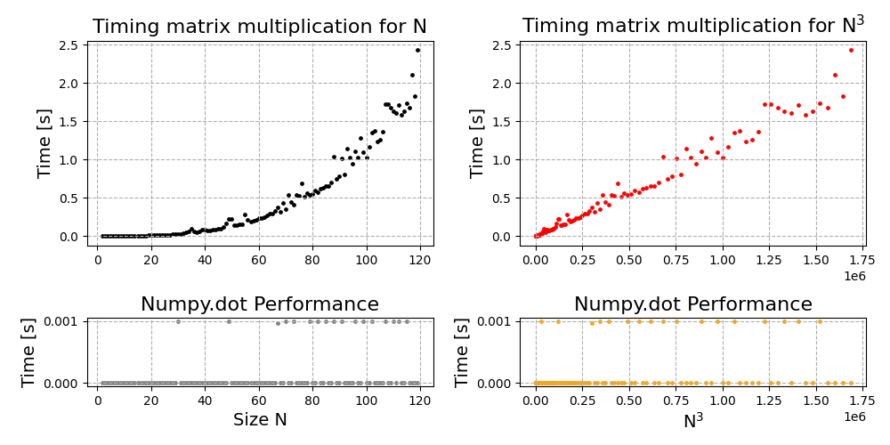

# Lab 1: Basic Python
This sub-directory contains the python scripts and written report for Lab 1 for Computational Physics. The breakdown of the lab is the following:

## Q1 - Modelling Planetary Orbits Through Euler-Cromer Method
We use two frameworks to model mercuries orbit the first one being Newtonian dynamics and the second one being general relativity. In both cases we use the Euler-Cromer method to solve the differential equations at hand.

    

## Q2 - Modelling Three Body Problem
The three bodies chosen to model are Earth, Jupiter, and the Sun. We use the Euler-Cromer metod to solve the respective equations and obtain each bodies orbit. Consequently we also model the same three bodies in the case Jupiter is 1000 times more massive.

    

## Q3 - Timing Matrix Multiplication
We implement tests to verify the time complexities and time relationship for matrix multiplication. We use numpy to perform the matrix multiplications.

    

