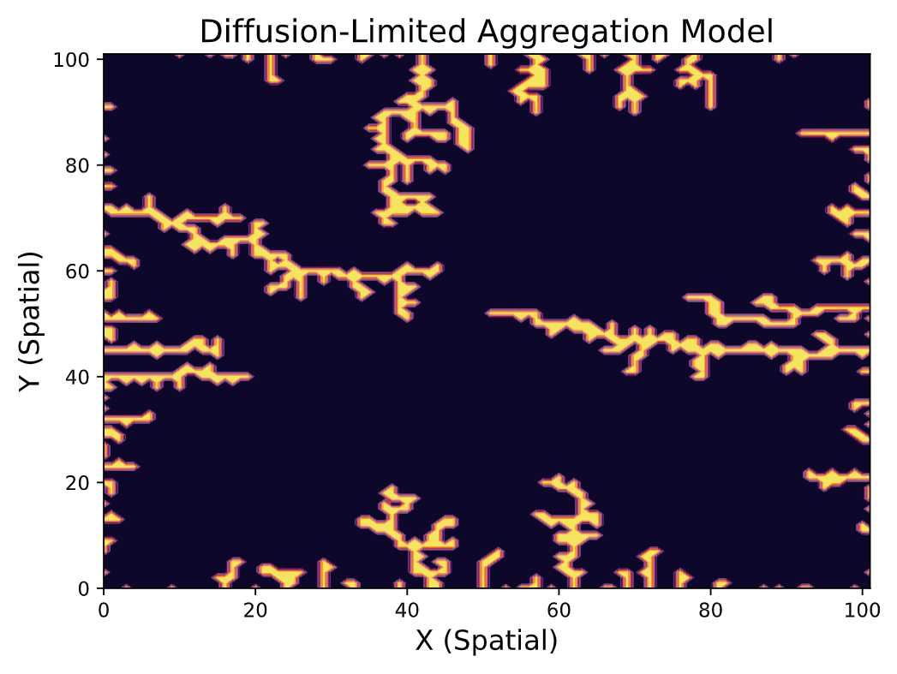

# Q10: Random Processes
This sub-directory contains the python scripts and written report for Lab 9 for Computational Physics. The breakdown of the lab is the following:

## Q1 - Brownian Motion and Diffusion-Limited Aggregation
We simulate 2-dimensional brownian motion by assuming a particle has equal probability in moving in any of the 4-directions (up, down, left, right). Secondly we simulate a diffusion-limited aggregation system for particles undegoing random walk. The simulation end once a particle has reached the center of the grid.

    

## Q2 - Volume of Hypersphere in 10-Dimensions
We implement a Monte-Carlo integration techinque to find the volumne of a sphere with radius R and n degrees of freedom. We verify the numerical results for a circle (n=2), and a sphere (n=3), and lastly we find the volumne of a hypersphere in 10 dimensions.

## Q3 - Importance of Sampling
We compute an integral through two methods, the first one uses uniform sampling from the range 0,1, while the second method samples non-uniformly from a specified probability distribution. The uniform sampling produced more precise results of the integral than the uniform sampling method.

    

