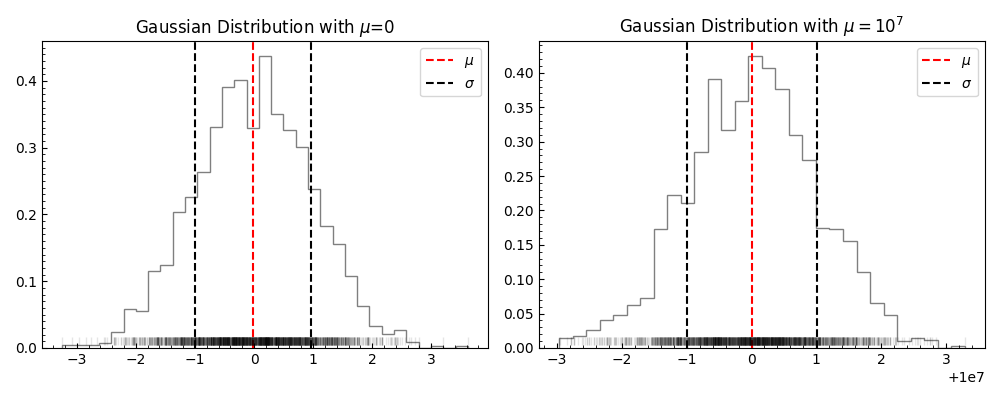
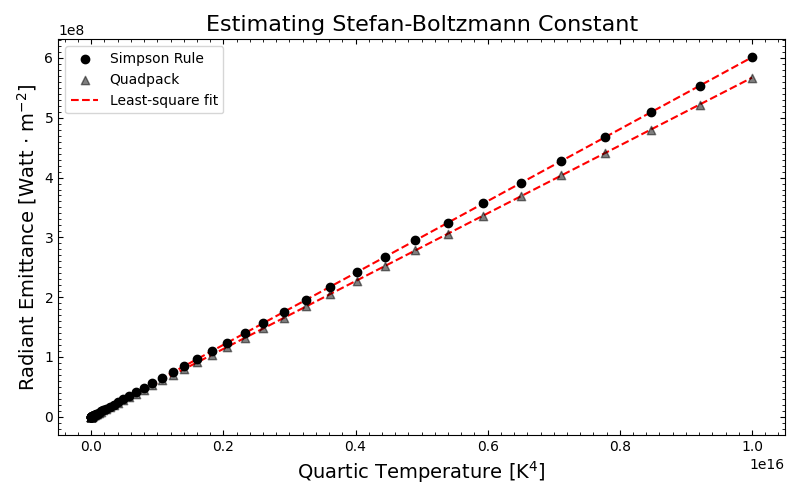
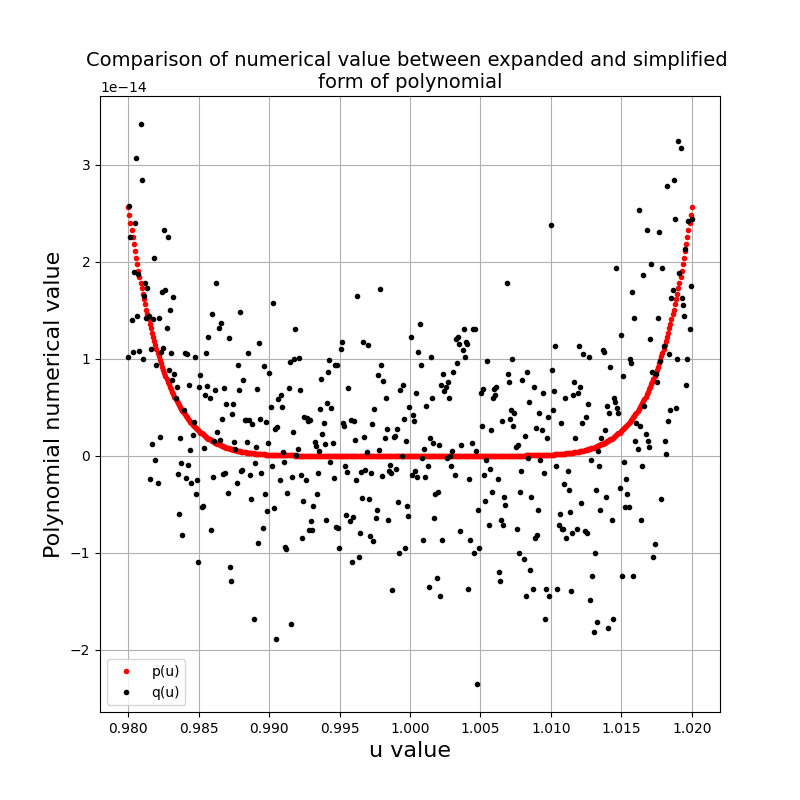

# Lab 2: Numerical Errors and Integration
This sub-directory contains the python scripts and written report for Lab 2 for Computational Physics. The breakdown of the lab is the following

## Q1 - Understanding Numerical Errors from Standard Deviation Calculations
We examine the contraints of perfoming numerical operations on big numbers and how this can lead to inaccuracies in computations. We examine the effects by computing the standard deviation of two gaussians one with high mean and one with low mean. Then we use a two-pass standard deviation equation and a one-pass standard deviation equation. We find the two-pass equation to perform more accurately than the one-pass algorithm. Finally we suggest an alternative implementation for the one-pass algorithm to improve its accuracy.

    

## Trapezoidal and Simpson's Rule for Integration
This section is a simple excercise for numerically integrating functionss through two disting methods, Trapezoidal and Simpson's Rule. We examine each method's accuracy and time complexity in relation to the number of slices required to reach machine precision.

## Calculating the Stefan Boltzman Constant
We start our work by integrating Plank's law for all wavelengths over a solid sphere to calculate the radiant emittance for an array of temperatures. We then use the Stefan-Boltzmann law to and our results of the integration to calculate the value of the Stefan Boltzman Constant.

    

## Exploring Roundoff Error
We explore how the rounding of small value carries noises into repeating calculations causing substantial scattering in their values. We examine the distribution of this noisy data and compare how the standard deviation of the noisy data compares to the round-off error, where we notice the round-off error to be larger by approximately 30%.

    

