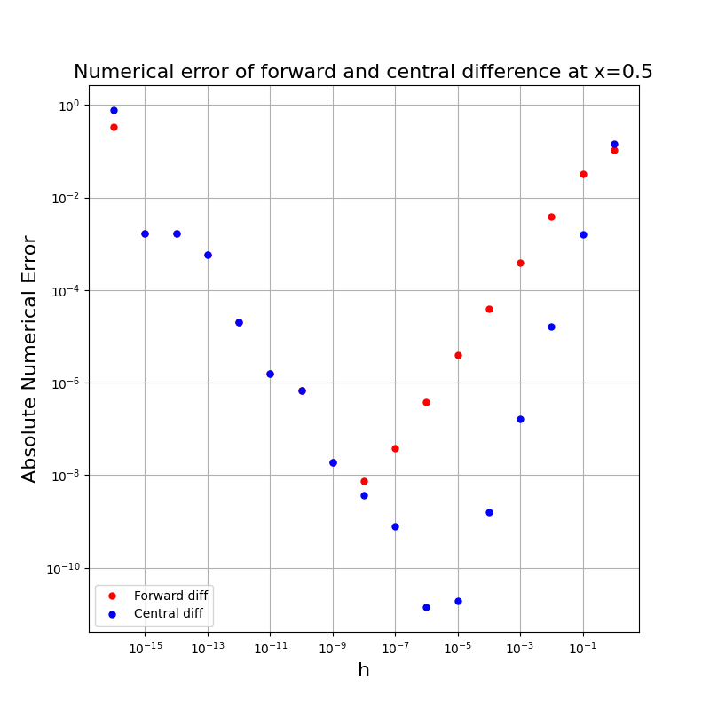
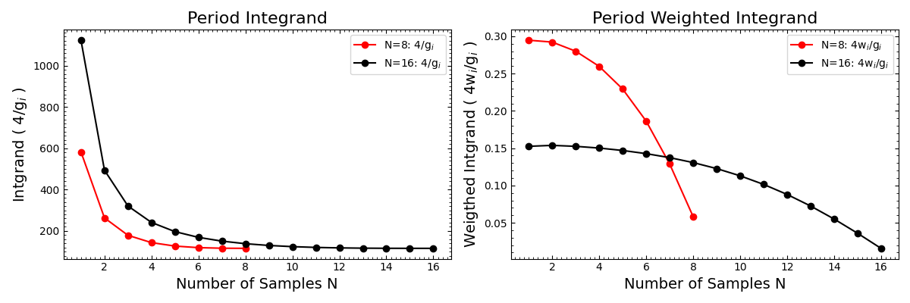
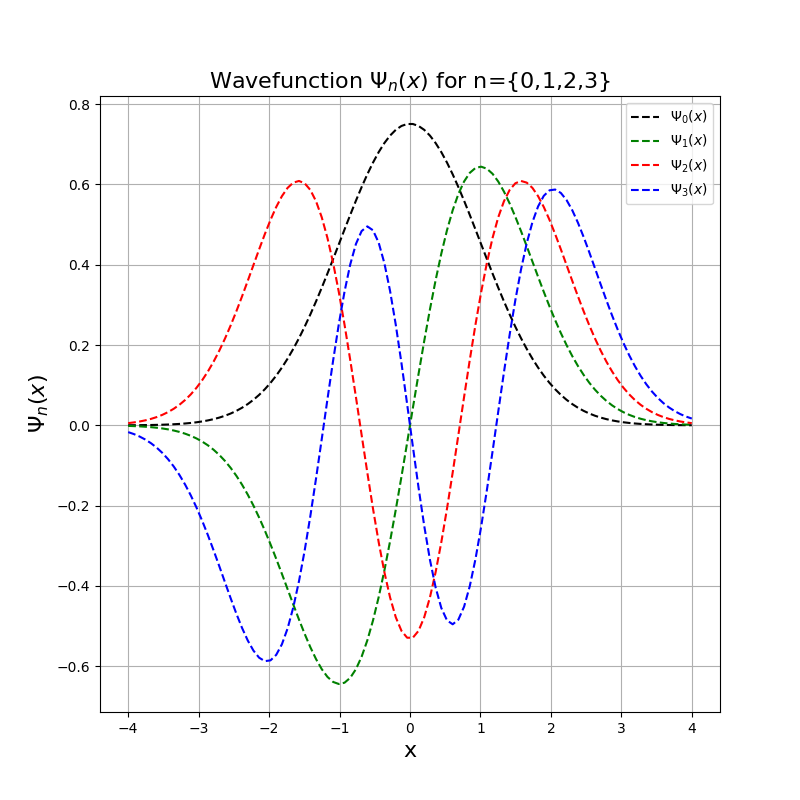

# Lab 3: Further Numerical Methods
This sub-directory contains the python scripts and written report for Lab 3 for Computational Physics. The breakdown of the lab is the following:

## Q1 - Numerical Differentiation Errors
We test two distinct methods for differentiation, forward difference differentiation scheme and central difference differentiation. For each routine we examing the effects of step size on numerical accuracy and determing that smaller step-size does not lead to more accurate computations.

    

## Q2 - Period of Relativistic Particle on a Spring
We examine the behaviour of some relativistic particle on a spring whose energy is conserved by exploring its classical behaviour for small amplitudes and exploring its relativistic behaviour for large amplitudes. We use Gaussian quadrature to verify the period the relativistic particle and we explore its numerical in constraints as a function of number of samples.

    

## Q3 - Calculating Quantum Mechanical Observables
We implement a function for finding the n-th Hermite polynomial and can also return the n-1 Hermite polynomial. We use this function to calculate the n-th wavefunction fo a quantium harmonic oscillator. We can extend our implementation to find the wavefunction of a quantum harminc oscillator at n=30. We also calculate the expected value of position and momentum, as well as the energy for each n-state of the wavefunction.

    

