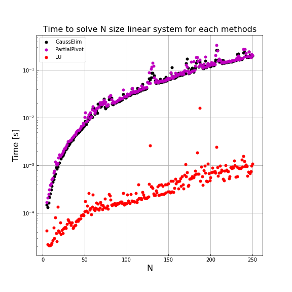
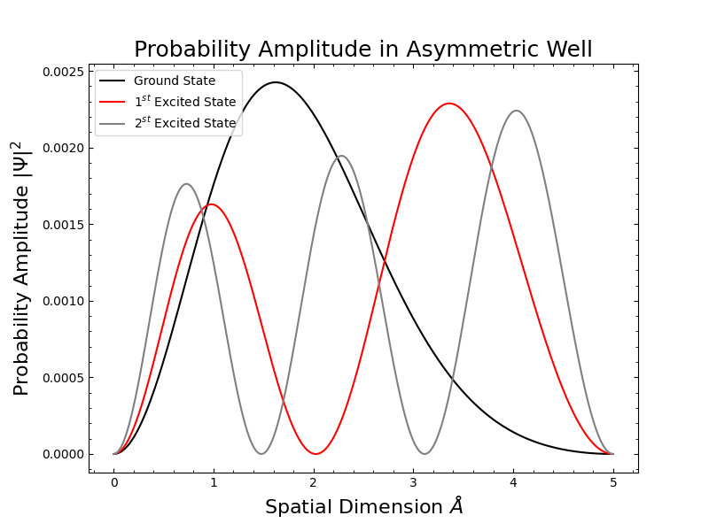
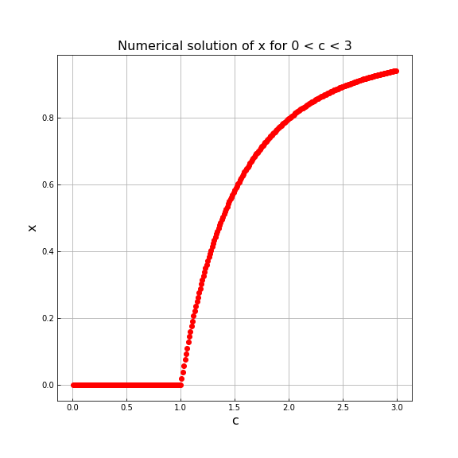

# Lab 4: Solving Linear Systems
This sub-directory contains the python scripts and written report for Lab 4 for Computational Physics. The breakdown of the lab is the following:

## Q1 - Solving Linear Systems
We implement a partial pivot algorithm to conduct a Gaussian elimination process for solving linear systems. Additionally, we compare accuracy and timing of three methods for solving linear systems, those being partial pivot, Gaussian elimination and LU decomposition. We observe the LU decomposition method to be superior both in accuracy and time than the other two.

    

## Q2 - Asymmetric Quantum Well
We compute the first 10 and 100 energy eigenvalues for an asymmetric quantum well and compare how their values differ. We use the resulting energy eigenvalues to plot the probability amplitudes of each energy eigenstate by integrating the wavefunction.

    

## Q3 - Solving Non-Linear Systems
We implement a relaxation method to solve to solve a non-linear equation for different coefficient values. With this we can examine a threshold where the specified coefficient affects the numerical results of the relaxation method. We later implement an over relaxation method and compare its perfomance to our previous results. Lastly we implement a binary search mehtod using recursion for solving additional non-linear systems.

    

