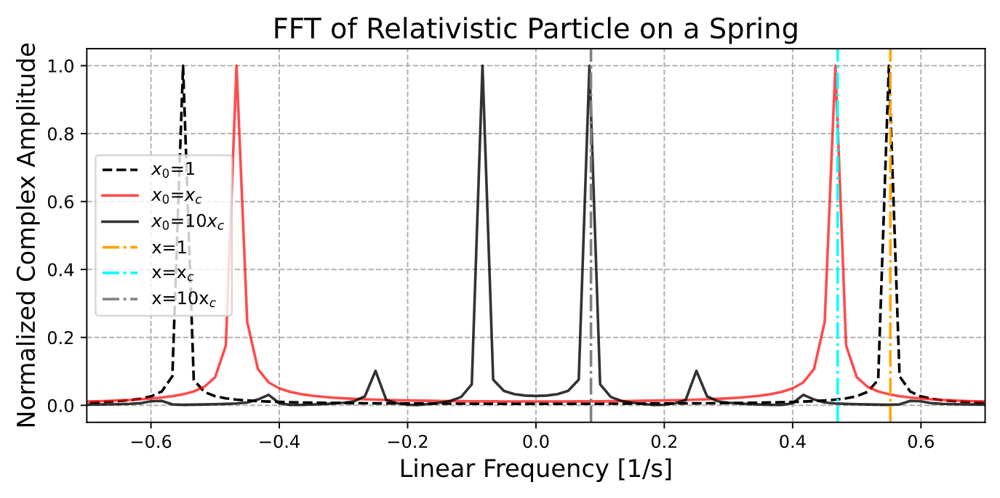
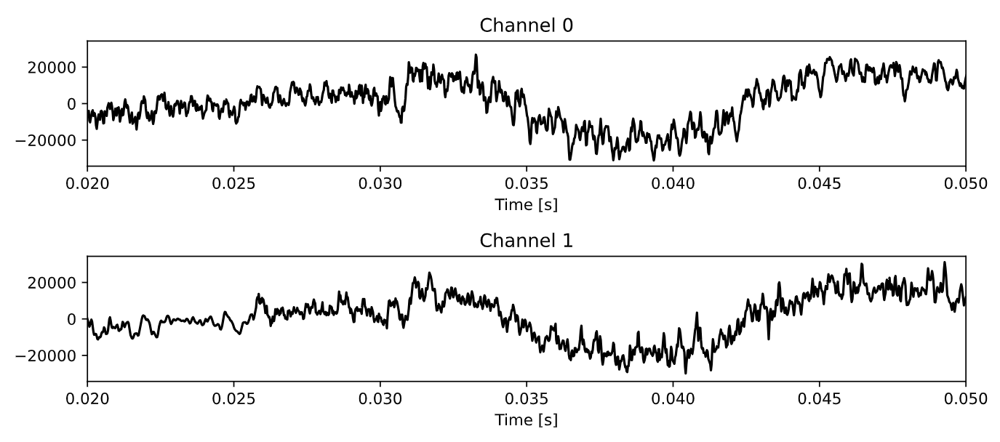
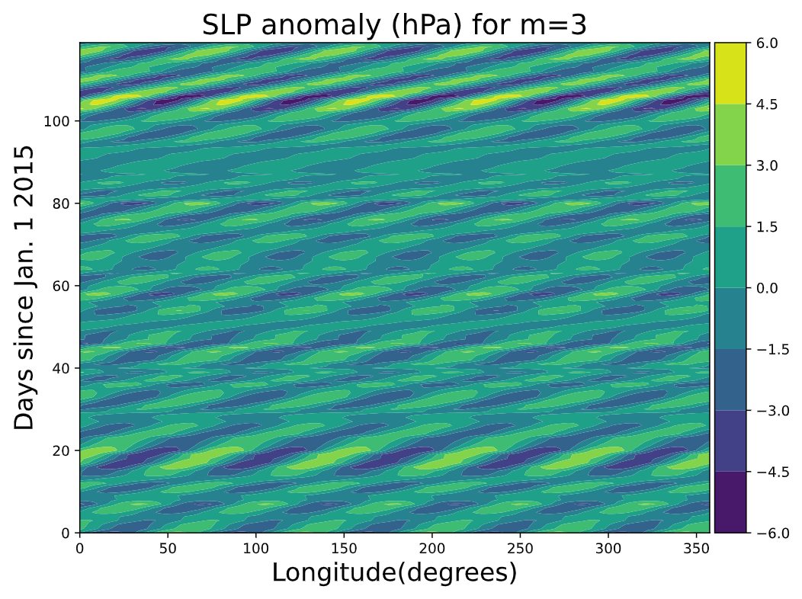

# Lab 5: Discrete Fourier Transforms
This sub-directory contains the python scripts and written report for Lab 5 for Computational Physics. The breakdown of the lab is the following:

## Q1 - Revisiting Relativistic Spring
We simulate our previous work of a relativistic particle on a srping by setting each simulation at different starting points. As previously discussed the initial displacement will play a role in the in priod of oscillation. We run an an FFT on the simulated position arrays of each scenario to find the frequency for each case. Our results are consistent with those found in Lab 3, stating a direct proportionality between amplitude and period.

    

## Q2 - Audio Filtering
We take in an audio file provided to us, and use fourier transforms to filter out high frequency signals. The original audio file is titled "GraviteaTime.wav" the edited audio file is titled "GraviteaTime_lpf.wav".

    

## Q3 - Analysis of Sea Level Pressure
Conduct 2-dimensional fourier decomposition on sea preassure in longitudinal direction to detect anomalies for distinct wavenumbers. We find that longer waves travel eastward slower than shorter waves.

    

