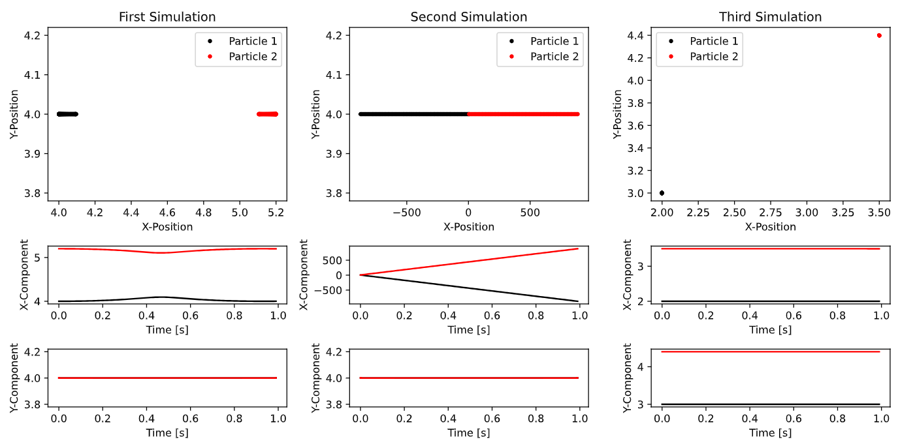
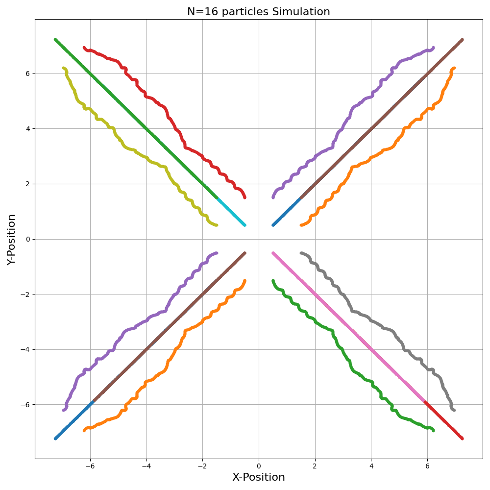

# Lab 6: Molecular Dynamics
This sub-directory contains the python scripts and written report for Lab 6 for Computational Physics. The breakdown of the lab is the following:

## Q1 - Molecular Trajectories Simulation
Implement Verlet method to simulate system of two particles in cartestian coordinates subject to the Lennard-Jones potential. We perform three molecular simulations for different starting points for each particle. Lastly we verify energy conservation in our simulation by observing the KE and PE of each particle.

    

## Q2 - Molecular Dynamics Simulation
Building on our previous results we simulate the dynamic interactions of 16 particles that are being subejct to the Lennard-Jones potential. We observe there to be major energy fluctuaitons in the simulation which could be due to the implementation of the Verlet method.

    

