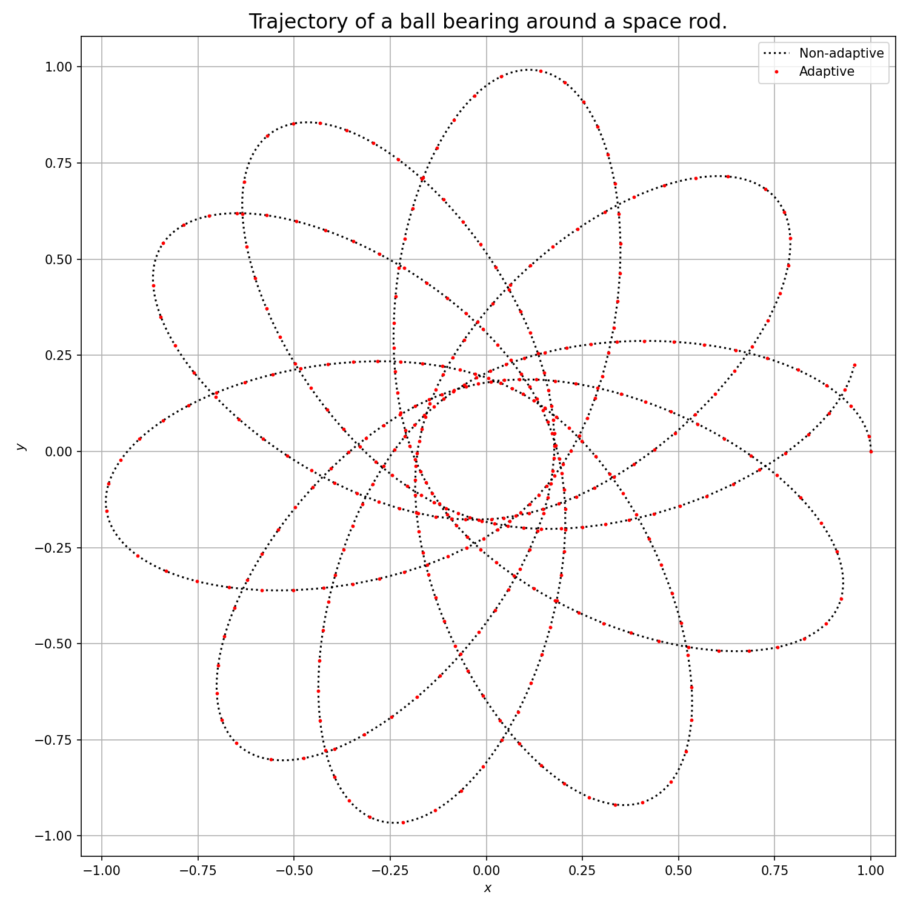
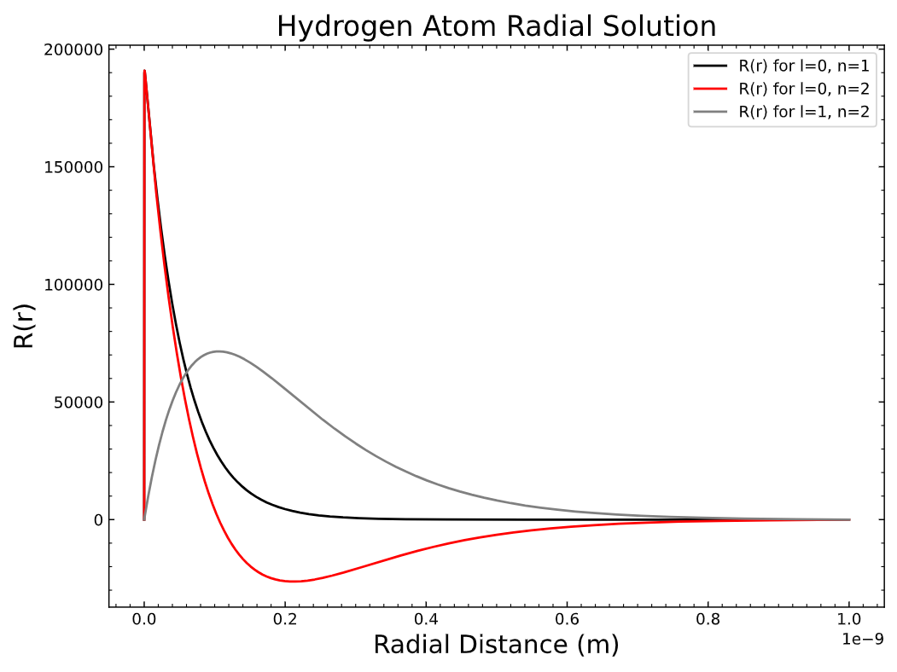

# Lab 7: Shooting Methods for Boundary Value Problems
This sub-directory contains the python scripts and written report for Lab 7 for Computational Physics. The breakdown of the lab is the following:

## Q1 - Space Garbage
We implement an adaptive step size method through RK-4 where the condition to satisfy is that of a target value for rho. We use this method as well as a simple RK-4 method to simulate the trajectory of a particle orbiting some point-like mass. We observe that the adaptive method completes the simulation in shorter time as well as with lesser number of steps.

    

## Q2 - Hydrogen Atom
We take the Shrodinger equation in spherical coordiantes for a central potential to compute the energy eigenvaues for n-states using a shooting method. The the roots of the shooting method were found
through the secant method by setting a threshold of e/1000. Additionally, we set the boundary conditions to zero at R(h) and at R(20a) such that we avoid divergence at the beginning.

    

