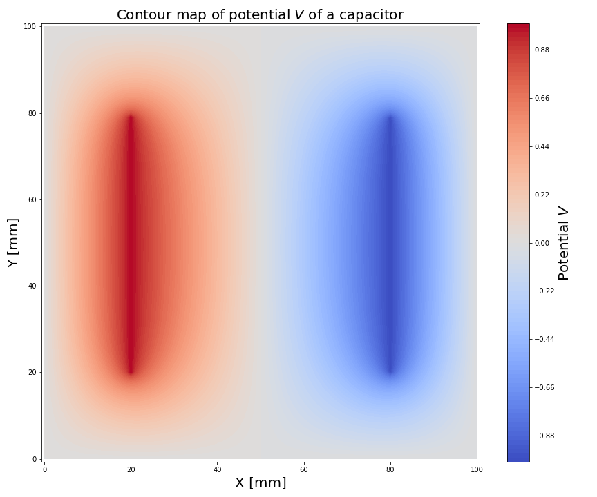
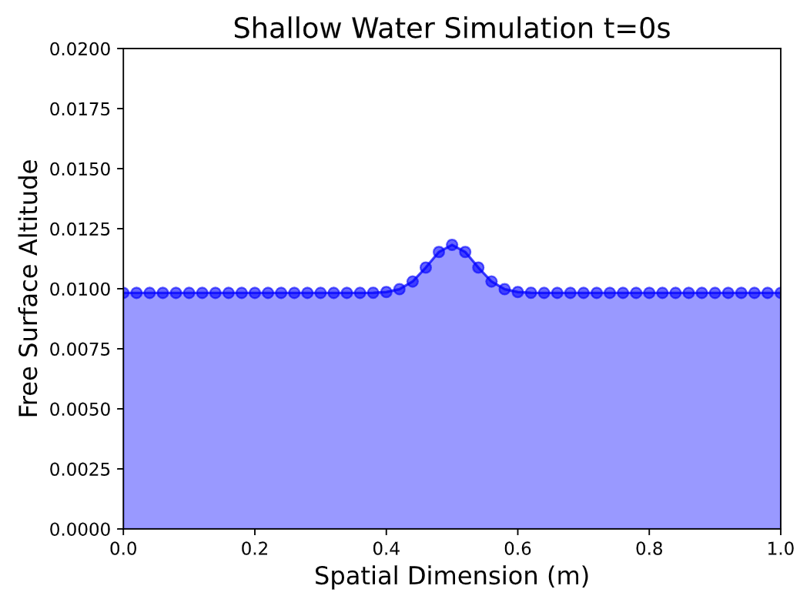

# Lab 8: Flux Conservative PDE's
This sub-directory contains the python scripts and written report for Lab 8 for Computational Physics. The breakdown of the lab is the following:

## Q1 - Electrostatics and Laplace's Equation
we calculate the electric potential everywhere in the box enclosing an electric capacitor, where the
potential satisfies laplaces equation, with specified boudary conditions. We find a numerical solution to the setup by using the Gauss-Seidel method without over-relaxation and a specified target solution accuracy.

    

## Q2 - Simulating Shallow Water Systems
We simulate a shallow water system through a flux conservative form of the 1-dimensional Navier Stokes equation. We specify a flat bottom topography, box length of 1m, spatial step 0.02m, temporal time step of 0.01 and average water column height of of 0.01m. The initial condition simulates a Gaussian-like perturbation. We additionally, perform a Von Neunmann numerical stability analysis to conclude that the FTCS method on the shallow water equation not stable.

    

