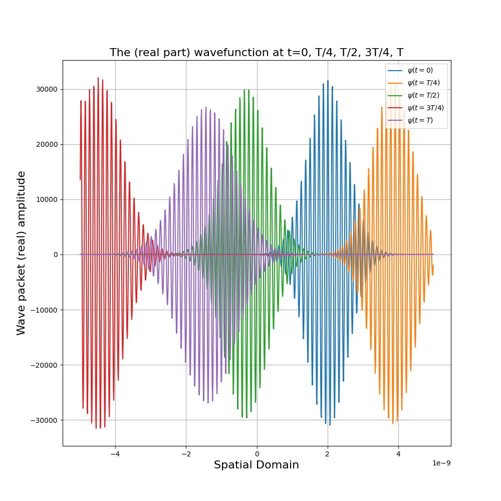

# Lab 9: Spatial Discretisation, Crank-Nicolson time stepper, Spectral Solutions
This sub-directory contains the python scripts and written report for Lab 9 for Computational Physics. The breakdown of the lab is the following:

## Q1 - Time-Dependent Shrodinger Equation
We use the Crank-Nicholson method to simulate the time evolution of a wave packet in an infinite square potential well. Please refer to the written report for the details of the discretization of the potential, Hamiltonian and wavefunction. Once we have simulated the wave packet we calculate the expected value of the position, as well as we verify that energy is constant in this system.

    

## Q2 - Simulating Resonant EM Cavity
We simulate a resonant electro-magnetic cavity through the spectral method. The boundary conditions require the electric and magnetic fields to be zero at the conducting walls. This boundary condtions can be satisfied through fourier series. We simulate the system with 32 spatial grids and for up to 20s with a temporal step size of 0.01s.

    

